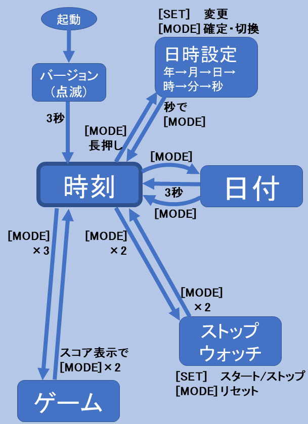

# VfdClock

VFD管デジタル時計

## 概要

VFD管のデジタル時計です。

時刻以外に以下のような機能があります。

* 日付表示
* ストップウォッチ
* 数字シューティング・ゲーム

## 使用方法

### 1. 起動

* 起動(または、リセット)すると、バージョン番号を約3秒間表示したのちに、時刻を表示します。

* バージョン表示中に[MODE]ボタンを押すと、即座に時計表示になります。

### 1.1 点滅効果

* 初期状態では、10秒ごとに、更新された桁の数字が点滅します。

* 時刻表示の状態で、[SET]ボタン → 点滅効果のON/OFF

### 2. 日付表示

* 時刻表示の状態で、[MODE]ボタン → 日時表示モード

* 日付表示のときは、ピリオドが消えます。

* 日付を 3秒間 表示すると、時刻表示に戻ります。

* 日付表示中に[MODE]ボタンで、すぐに時刻表示に戻ります。
つまり、[MODE]ボタンで、時刻と日付を交互に切り替えます。

### 3. 日時設定方法

1. [MODE]ボタン「長押し」 → 日時設定モード (「年」が点滅)

2. 日時設定時に[MODE]ボタン(短押し) → 「年→月→日→時→分→秒→日時確定」の切換

3. [SET]ボタン → 点滅部分がカウントアップ (「秒」の場合は、10秒単位、長押しで早送り可能)

4. 「秒」設定のとき、[MODE]ボタン「短押し」 → 日付表示(数秒) → 時刻表示

5. 「秒」設定のとき、[MODE]ボタン「長押し」 → 「年」設定に戻ります。

### 4. ストップウォッチ

1/100秒の精度で時間を計れます。

#### 使い方

* 時計表示中に [MODE]ボタンを「ダブルクリック」すると、ストップウォッチのモードになります。

* ストップウォッチのモードで [MODE]ボタンを「ダブルクリック」すると、時計表示に戻ります。  
  ※ ストップウォッチを動作させたまま、時刻表示に戻ることができます。

* [SET]ボタン：スタート/ストップ

* [MODE]ボタン：リセット

### 5. 数字シューティング・ゲーム

迫り来る敵(数字の列)を打ち落とす、単純なシューティングゲームです。

#### 遊び方

* 時計表示中に[MODE]ボタンを「トリプル・クリック」すると、ゲームがスタートします。

* 左端の桁がプレーヤーです。

* 右側から敵(数字)が連なって出てきます。

* [MODE]ボタンで、自分の数字を敵の先頭の数字に合わせて、

* [SET]ボタンで打ちます。

* 敵に当たると、先頭の敵が消えます。次の敵も同様に打ち落として下さい。

* 数字があってないと敵は消えません。

* 次第に敵の速度が速くなってきます。

* 敵が自分のところに到達するとGame Overです。

* 打ち落とした敵の数を点滅表示します。

* 得点表示中に、どちらかのボタンを「長押し」で、リプレイできます。

* 得点の点滅が止まってから、[MODE] ボタンを「ダブルクリック」で、時計表示に戻ります。

-----
## [変更履歴](ChangeLog.md)
