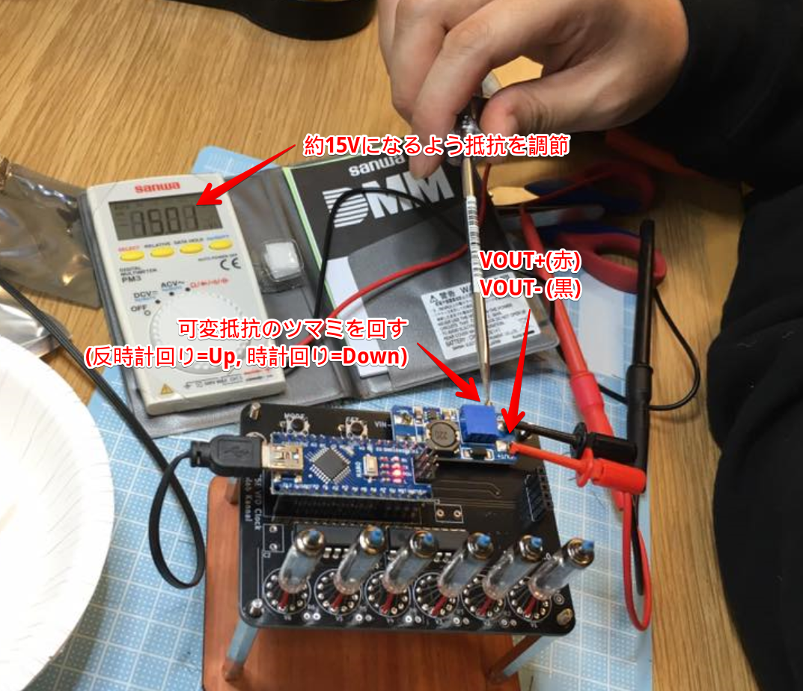
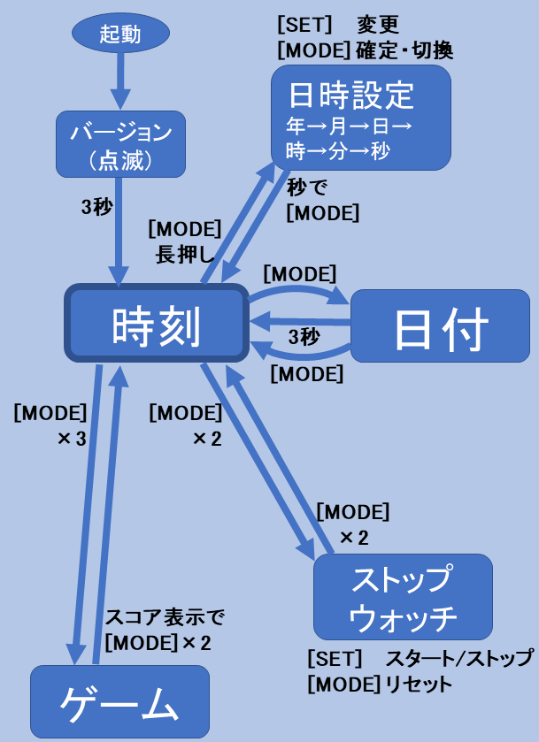

# VFD管時計の組み立て

## 1. 部品の確認

- 基板 x 1
- VFD管 x 6
- 電源モジュール x1
- Arduino Nano基板 x 1
- トランジスタアレイ TBD62783APG x 2
- 抵抗(200Ω) x 6
- タクトスイッチ x2
- ピンソケット(15ピン) x 2
- ピンソケット(5ピン) x 1
- ピンヘッダ(4ピン) x 2
- RTCモジュール x 1
- USB充電器 x 1
- USBケーブル x 1

## 2. 必要な道具
半田ごて
ニッパー
ピンセット(あると便利)
ドライバー(+/-)
テスター

## 3. はんだ付け
### トランジスタアレイIC、スイッチ
トランジスタアレイIC TBD62783APGをU2, U3の位置にはんだ付けします。ICの切り欠きを基板上の切り欠きに合わせて基板に差し込んで下さい。

### ピンヘッダ、ピンソケット
Arduinoのピンソケットは、Arduinoに挿してから基板に取り付けると取り付けやすくなります。

電源モジュール部分のピンヘッダは、４本のうち間の２本を抜いたものを2つ作って基板にはんだ付けしておきます。

### 電源モジュール
VIN, VOUTの向きに注意して差し込み、モジュールの上からはんだ付けします。

## 3. VFDの取り付け
赤いチューブが付いているピンを基板の丸が付いている穴に差し込み、他のピンも穴に差し込んでいきます。ピンがクロスしないように注意して下さい。

VFD管を1つ差し込むごとに、前後2箇所をはんだ付けで仮止めします。すべての管を差し込んだら、VFD管の向きと高さを全体的に揃えた後にすべてのピンをはんだ付けします。最終的な見た目に影響するので丁寧に進めて下さい。

## 4. 電圧の調整
VOUT+, VOUT-にテスターを接続し、電圧計モードにします。
Arduinoを基板に差し込み、USBケーブルでUSB充電器に接続します。
電圧を見ながら、電源モジュールの可変抵抗についているつまみをマイナスドライバーで反時計回りに回していきます。最初の数回転は電圧が変化しない場合がありますが、そのまま回転させると電圧が上がり始めるので、約15Vまで上がるように調節します。

電圧の調整が終わったら抵抗(R1-R6)をはんだ付けします。

## 5. RTCモジュールの取り付け
電源を外し、RTCモジュールを基板に接続します。再度電源を接続するとVFDが点灯し、バージョン情報が表示された後に時刻が表示されるはずです。操作説明に沿って時刻を調整して下さい。

## 操作説明

## 6. ケースの組み立て 

## トラブルシュート

### VFDが点灯しない
- ハンダが浮いているところはないか
- VFDのピン位置は合っているか
- Arduinoのリセットボタン("NANO"の文字の下の白いボタン)を押してみる

### 電圧が上がらない
- 反時計回りに回しているか(数回転しなければ上がらない場合があります)
- VIN+, VIN-にテスターを当てて5V出ているか確認
- 出ていなければArduino部分のピンヘッダハンダ付け確認

### 時計が'000000'のまま進まない
- RTCモジュールを挿しているか
- Arduinoのリセットボタンを押して見る
