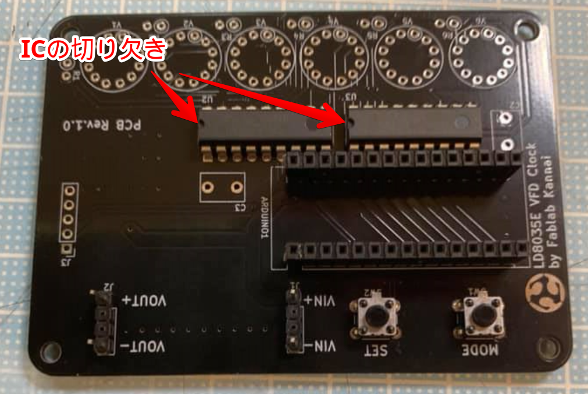
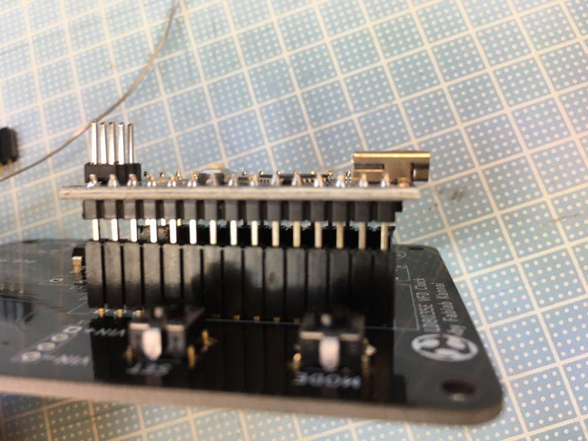
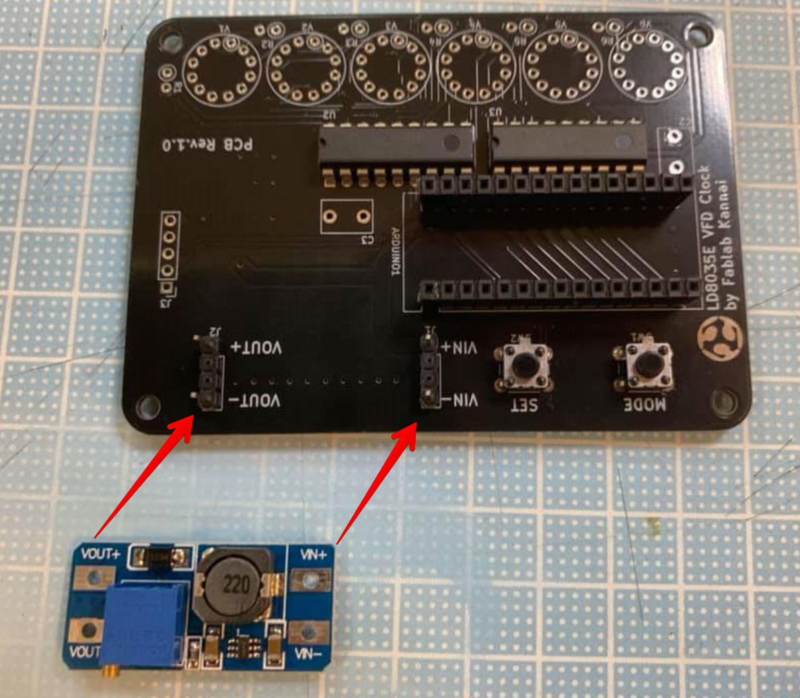
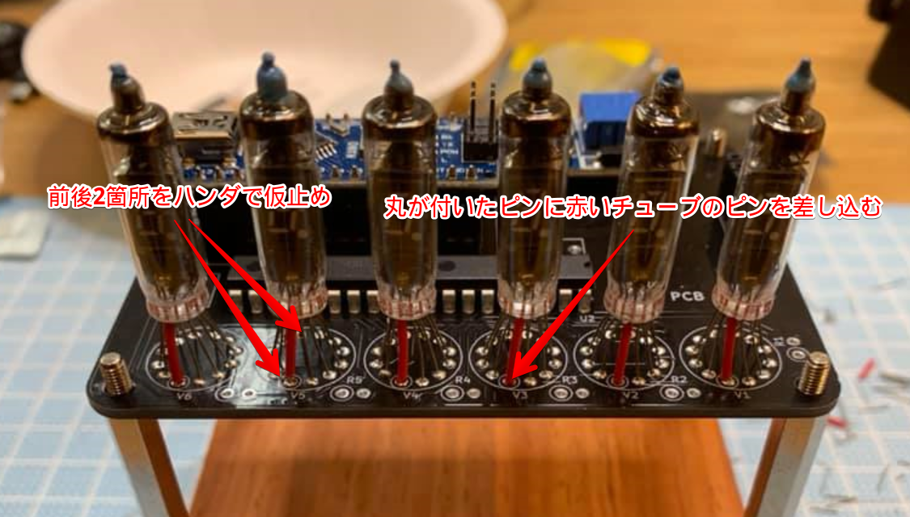
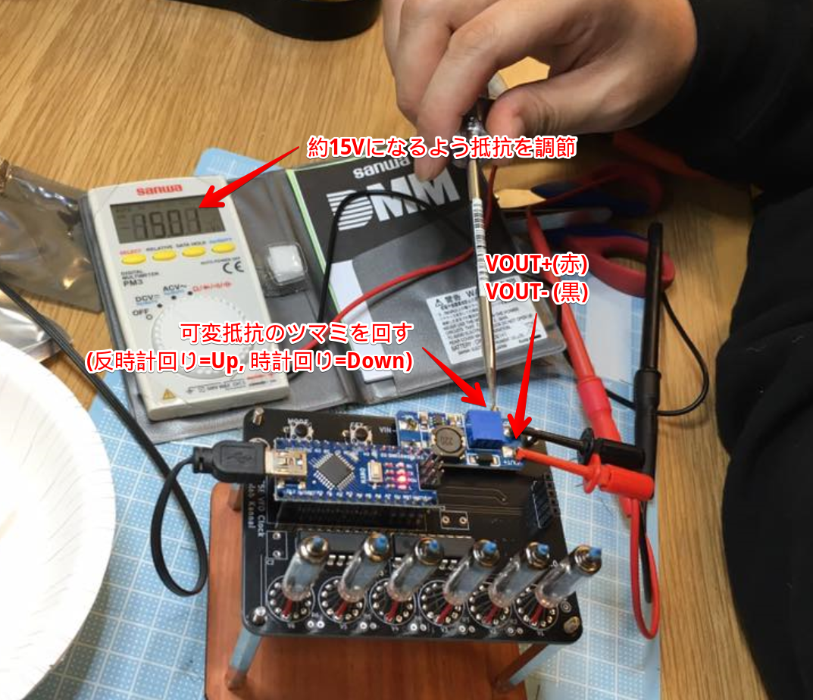
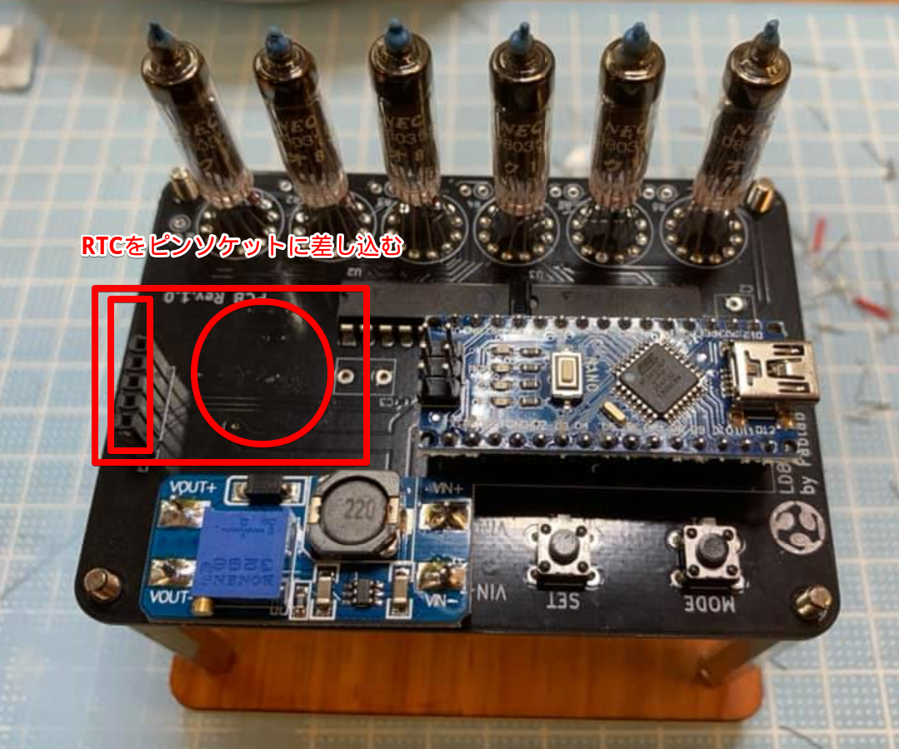
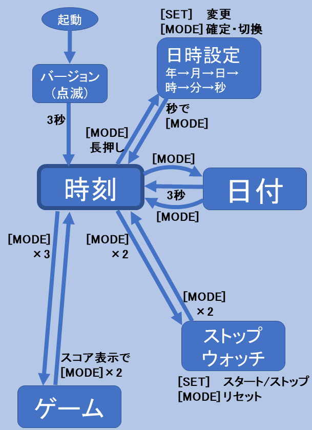
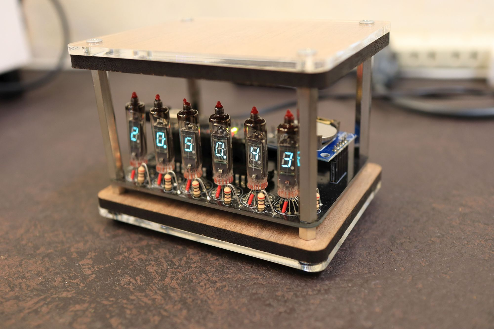

# VFD Clock Kit Assembly Instructions

## 1. List of Components
- PCB x 1
- VFD Tube x 6
- Power Supply x1
- Arduino Nano x 1
- Transistor Array IC TBD62783APG x 2
- Resistor(200Ω) x 6
- Switch x2
- Pin Header x 2
- Pin Socket x 1
- RTC Module x 1
- USB Cable x 1

## 2. Tools Required
Soldering iron and Solder (lead / tin solder is recommended)
Wire Cutters
Tweezers
Screwdriver
Multimeter
Desoldering Wick

The clock kit does not include power adapter. USB Smartphone Charger should be used with the kit.

## 3. Assembly of the PCB
### Transistor Array and Switches
Solder TBD62783APG to U2 and U3. Align nothes on the component to the mark on the PCB.

### Pin Headers and Pin Sockets
Snap off pin headers and pin sockets required numbers and mount on the following places.
**Pin Headers**
 - Arduino Nano
 - J3 (5 pins x1)
 - Power Supply Module (4pins x 2)

For the headers of power supply modules, pull off the middle two pins before installing.

### Power Supply Module
Install power module. Align VIN and VOUT mark on the PCB and module.

## 3. VFD
Install VFD tubes V1 - V6.
Start with the pins with red tube, insert the pin into hole on the PCB marked with circle.
Every time you finish installing one VFD tubes to PCB, do not solder all pins. Temporarily solder red tube pin so that you can adjust alignment of all tubes.

## 4. Voltage Adjustment
Set the multimeter to voltage measurement mode and connect it to VOUT+ and VOUT-. Insert Arduino Nano on the PCBA, and connect USB cable to USB Smartphone charger.
Adjust output voltage of the VOUT+ and VOUT- to 15V by rotating VR with screwdriver (Counter-clockwise to increase voltage). Output voltage may not increase for a number of rotations, keep rotating the VR until output voltage reaches desired voltage.

Pull off the USB cable and mount R1 - R6 after you finish the voltage adjustment.

## 5. Install RTC Module
Install RTC modules.
Connect USB Cable to Arduino, you will see the VFD counting time. 

## User Guide

## 6. Case Assembly
Refer pictures below

