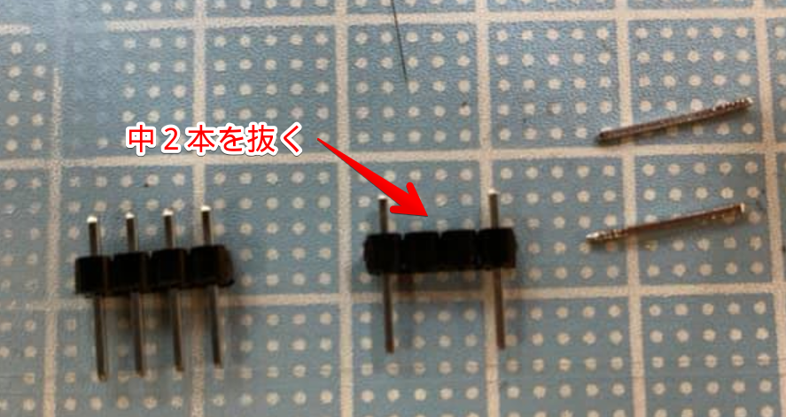

# VFD Clock Kit Assembly Instructions

## 1. List of Components
- PCB x 1
- VFD Tube x 6
- Power Supply x1
- Arduino Nano x 1
- Transistor Array IC TBD62783APG (or M54564P) x 2
- Resistor(180Ω) x 6
- Tactile Switch x2
- Pin Header(40pin) x 1
- Pin Header(15pin) x2
- Pin Socket x 1
- RTC Module x 1

## 2. Tools Required
- Soldering iron and Solder (lead / tin solder is recommended)
- Wire Cutters
- Tweezers
- Screwdriver
- Multimeter
- Desoldering Wick

The clock kit does not include power adapter. Please use USB Type-A charger more than 1A output.

## 3. Assembly of the PCB
### Transistor Array and Switches
Solder TBD62783APG (or M54564P) to U2 and U3. Align notches on the component to the mark on the PCB.

### Pin Headers and Pin Sockets
Snap off pin headers and pin sockets required pin counts and mount on the following places.

**Pin Headers**
 - Arduino Nano (Solder Pin headers on  Nano, and Pin Sockets on the PCB)
 - J3 (5 pins x1)
 - Power Supply Module (4pins x 2)

**Pin Sockets**

- Arduino Nano (PCB Side)

For the headers of power supply modules, pull off the middle two pins before soldering.

### Power Supply Module
Install power module. Align VIN and VOUT mark on the PCB and module.

## 3. VFD
Install VFD tubes V1 - V6.
Start with the pins with red tube, insert the pin into hole on the PCB marked with circle.
Every time you finish installing one VFD tubes to PCB, do not solder all pins. Temporarily solder red tube pin so that you can adjust to align all tubes.

## 4. Voltage Adjustment
Set the multimeter to voltage measurement mode and connect it to VOUT+ and VOUT-. Insert Arduino Nano to the board and connect USB cable to power.
Adjust output voltage of the VOUT+ and VOUT- to 18V by rotating VR with screwdriver (Counter-clockwise to increase voltage. Rotate multiple times if the voltage is not increasing). Keep rotating until output voltage reaches desired voltage.

Pull off the USB cable and mount R1 - R6 after the voltage set correctly.

## 5. Install RTC Module
Install RTC modules.
Connect USB Cable to Arduino, you will see the VFD counting time. 

## User Guide
Refer [User Guide](docs/Guide.pdf) for how to adjust time, change modes.

## 6. Case Assembly
Refer pictures below
 - Install Flat Head Screw on the rooftop
 - Use round head screw to fix rubber foot

